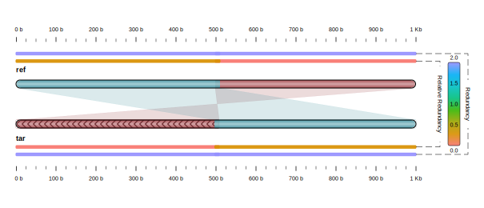

# Smash++

[](https://travis-ci.com/smortezah/smashpp)
[](https://www.codacy.com?utm_source=github.com&amp;utm_medium=referral&amp;utm_content=smortezah/smashpp&amp;utm_campaign=Badge_Grade)
[](LICENSE)

## What is Smash++?
A fast tool to find and visualize rearrangements in DNA sequences.

## Install
To install Smash++ on various operating systems, follow the instructions below. Note that the precompiled executables are available for 64 bit operating systems in the "bin/" directory.

<!-- ### Conda -->


### Linux
* Install "git" and "cmake":
```bash
  sudo apt update
  sudo apt install git cmake
```
* Clone Smash++ and install it:
```bash
  git clone https://github.com/smortezah/smashpp.git
  cd smashpp
  ./install.sh
```

### macOS
* Install "Homebrew", "git" and "cmake":
```bash
  /usr/bin/ruby -e "$(curl -fsSL https://raw.githubusercontent.com/Homebrew/install/master/install)"
  brew install git cmake
```
* Clone Smash++ and install it:
```bash
  git clone https://github.com/smortezah/smashpp.git
  cd smashpp
  ./install.sh
```

### Windows
* Download and install [CMake](https://github.com/Kitware/CMake/releases/download/v3.14.4/cmake-3.14.4-win64-x64.msi) and [mingw-w64](https://sourceforge.net/projects/mingw-w64/files/latest/download). Make sure to add them to the system PATH. For example, if CMake is installed in "C:\Program Files" and mingw-w64 is installed in "C:\mingw-w64", add "C:\Program Files\CMake\bin" and "C:\mingw-w64\mingw64\bin" to the system PATH.
* Download and install [git](https://git-scm.com/download/win).
* Clone  Smash++ and install it:
```bat
  git clone https://github.com/smortezah/smashpp.git
  cd smashpp
  .\install.bat
```

## Run
```bash
./smashpp [OPTIONS]  -r <REF-FILE>  -t <TAR-FILE>
```
For example,
```bash
./smashpp -r ref -t tar
```
It is highly recommended to choose short names for reference and target 
sequences.

### Options
To see the possible options for Smash++, type:
```bash
./smashpp
```
which provides the following:
```text
SYNOPSIS
  ./smashpp [OPTIONS]  -r <REF-FILE>  -t <TAR-FILE>

OPTIONS
  Required:
  -r  <FILE>         = reference file (Seq/FASTA/FASTQ)
  -t  <FILE>         = target file    (Seq/FASTA/FASTQ)

  Optional:
  -l  <INT>          = level of compression: [0, 5]. Default -> 0
  -m  <INT>          = min segment size: [1, 4294967295]     -> 50
  -e  <FLOAT>        = entropy of 'N's: [0.0, 100.0]         -> 2.0
  -n  <INT>          = number of threads: [1, 8]             -> 4
  -f  <INT>          = filter size: [1, 4294967295]          -> 256
  -ft <INT/STRING>   = filter type (windowing function):     -> hann
                       {0|rectangular, 1|hamming, 2|hann,
                       3|blackman, 4|triangular, 5|welch,
                       6|sine, 7|nuttall}
  -fs [S][M][L]      = filter scale:                         -> L
                       {S|small, M|medium, L|large}
  -d  <INT>          = sampling steps                        -> 1
  -th <FLOAT>        = threshold: [0.0, 20.0]                -> 1.5
  -rb <INT>          = ref beginning guard: [-32768, 32767]  -> 0
  -re <INT>          = ref ending guard: [-32768, 32767]     -> 0
  -tb <INT>          = tar beginning guard: [-32768, 32767]  -> 0
  -te <INT>          = tar ending guard: [-32768, 32767]     -> 0
  -dp                = deep compression                      -> no
  -nr                = do NOT compute self complexity        -> no
  -sb                = save sequence (input: FASTA/FASTQ)    -> no
  -sp                = save profile (*.prf)                  -> no
  -sf                = save filtered file (*.fil)            -> no
  -ss                = save segmented files (*.s[i])         -> no
  -sa                = save profile, filetered and           -> no
                       segmented files
  -rm k,[w,d,]ir,a,g/t,ir,a,g:...
  -tm k,[w,d,]ir,a,g/t,ir,a,g:...
                     = parameters of models
                <INT>  k:  context size
                <INT>  w:  width of sketch in log2 form,
                           e.g., set 10 for w=2^10=1024
                <INT>  d:  depth of sketch
                <INT>  ir: inverted repeat: {0, 1, 2}
                           0: regular (not inverted)
                           1: inverted, solely
                           2: both regular and inverted
              <FLOAT>  a:  estimator
              <FLOAT>  g:  forgetting factor: [0.0, 1.0)
                <INT>  t:  threshold (no. substitutions)
  -ll                = list of compression levels
  -h                 = usage guide
  -v                 = more information
  --version          = show version
```

To see the options for Smash++ Visualizer, type:
```bash
./smashpp -viz
```
which provides the following:
```text
SYNOPSIS
  ./smashpp -viz [OPTIONS]  -o <SVG-FILE>  <POS-FILE>

OPTIONS
  Required:
  <POS-FILE>         = position file, generated by
                       Smash++ tool (*.pos)

  Optional:
  -o  <SVG-FILE>     = output image name (*.svg)             -> map.svg
  -rn <STRING>       = reference name shown on output. If it
                       has space, use double quotes, e.g.
                       "Seq label". Default: name in header
                       of position file
  -tn <STRING>       = target name shown on output
  -l  <INT>          = type of the link between maps: [1, 6] -> 1
  -c  <INT>          = color mode: [0, 1]                    -> 0
  -p  <FLOAT>        = opacity: [0.0, 1.0]                   -> 0.9
  -w  <INT>          = width of the sequence: [15, 100]      -> 16
  -s  <INT>          = space between sequences: [15, 200]    -> 62
  -f  <INT>          = multiplication factor for             -> 43
                       color ID: [1, 255]
  -b  <INT>          = beginning of color ID: [0, 255]       -> 0
  -rt <INT>          = reference tick: [1, 4294967295]
  -tt <INT>          = target tick: [1, 4294967295]
  -th [0][1]         = tick human readable: 0=false, 1=true  -> 1
  -m  <INT>          = minimum block size: [1, 4294967295]   -> 1
  -vv                = vertical view                         -> no
  -nn                = do NOT show normalized relative       -> no
                       compression (NRC)
  -nr                = do NOT show self complexity           -> no
  -ni                = do NOT show inverse maps              -> no
  -ng                = do NOT show regular maps              -> no
  -h                 = usage guide
  -v                 = more information
  --version          = show version
```

### Example
After installing Smash++, copy its executable file into "example/" directory and go to that directory:
```bash
cp smashpp example/
cd example/
```
There is in this directory a 1000 byte reference sequence, named "refs", and a 1000 byte target sequence, named "tars". Running
```bash
./smashpp -r refs -t tars -f 45 -l 3
./smashpp -viz -p 1 -s 50 -w 15 refs.tars.pos
```
results in the following image:
<p align=center></p>

<!-- ### Compare Smash++ with other methods
In order for comparison, you might set the parameters in 
"run.sh" bash script, then run it:
```bash
./run.sh
```
With this script, you can download the datasets, install the dependencies, 
install the other tools, run all the tools, and finally, visualize the results. -->

## Cite
Please cite the following, if you use Smash++:
* In process ...

## Releases
* [Release](https://github.com/smortezah/smashpp/releases) 1: .

## Issues
Please let us know if there is any 
[issues](https://github.com/smortezah/smashpp/issues).

## License
Smash++ is under GPL v3 license. For more information, click 
[here](http://www.gnu.org/licenses/gpl-3.0.html).