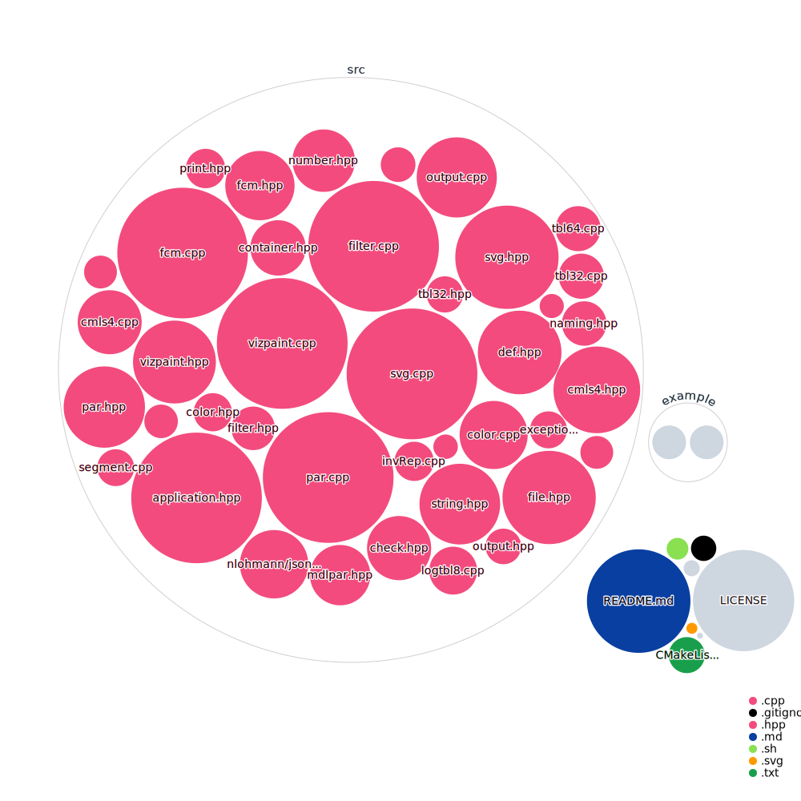

# Smash++
[](LICENSE)
[](https://github.com/smortezah/smashpp/actions/workflows/ci.yml)
[](https://gitnft.quine.sh/app/commits/list/repo/smashpp)

A fast tool to find and visualize rearrangements in DNA sequences.

## Install

Installing Smash++ requires CMake >=3.5 and a C++14 compliant compiler.

### Docker

```bash
# Pull the image
docker pull smortezah/smashpp;

# Run the container
docker run -it smortezah/smashpp
```

### Conda

Install [Miniconda](https://docs.conda.io/en/latest/miniconda.html), then run the following:

```bash
conda install -c bioconda -y smashpp
```

### Ubuntu

```bash
# Install Git, CMake and g++
apt update && apt install -y git cmake g++;

# Clone the repository and install it
git clone --depth 1 https://github.com/smortezah/smashpp.git;
cd smashpp;
bash install.sh
```

### macOS

```bash
# Install Homebrew, Git and CMake
/bin/bash -c "$(curl -fsSL https://raw.githubusercontent.com/Homebrew/install/HEAD/install.sh)";
brew install git cmake;

# Clone the repository and install it
git clone --depth 1 https://github.com/smortezah/smashpp.git;
cd smashpp;
bash install.sh
```

### Windows

Install [WSL](https://docs.microsoft.com/en-us/windows/wsl/install-win10) (Windows Subsystem for Linux), then clone Smash++ and install it, like in Ubuntu:

```bash
git clone --depth 1 https://github.com/smortezah/smashpp.git;
cd smashpp;
./install.sh
```

**Note**: in all operating systems, in the case of permission denial, you can use the `sudo` command.

## Run

```bash
./smashpp [OPTIONS] -r <REF_FILE> -t <TAR_FILE>
```

For example,

```bash
./smashpp -r ref -t tar
```

It is recommended to choose short names for reference and target sequences.

### Options

To see the possible options for Smash++, type:

```bash
./smashpp
```

which provides the following:

```text
SYNOPSIS
      ./smashpp [OPTIONS]  -r <REF_FILE>  -t <TAR_FILE>

SAMPLE
      ./smashpp -r ref -t tar -l 0 -m 1000
      ./smashpp \ 
          --reference ref \ 
          --target tar \ 
          --format json \ 
          --verbose 

OPTIONS
    Required:
      -r, --reference <FILE>       reference file (Seq/FASTA/FASTQ)
      -t, --target <FILE>          target file    (Seq/FASTA/FASTQ)

    Optional:
      -l, --level <INT>
            level of compression: 0 to 6. Default: 3

      -m, --min-segment-size <INT>
            minimum segment size: 1 to 4294967295. Default: 50

      -fmt, --format <STRING>
            format of the output (position) file: {pos, json}.
            Default: pos

      -e, --entropy-N <FLOAT>
            entropy of 'N's: 0.0 to 100.0. Default: 2.0

      -n, --num-threads <INT>
            number of threads: 1 to 255. Default: 4

      -f, --filter-size <INT>
            filter size: 1 to 4294967295. Default: 100

      -ft, --filter-type <INT/STRING>
            filter type (windowing function): {0/rectangular,
            1/hamming, 2/hann, 3/blackman, 4/triangular, 5/welch,
            6/sine, 7/nuttall}. Default: hann

      -fs, --filter-scale <STRING>
            filter scale: {S/small, M/medium, L/large}

      -d, --sampling-step <INT>
            sampling step. Default: 1

      -th, --threshold <FLOAT>
            threshold: 0.0 to 20.0. Default: 1.5

      -rb, --reference-begin-guard <INT>
            reference begin guard: -32768 to 32767. Default: 0

      -re, --reference-end-guard <INT>
            reference ending guard: -32768 to 32767. Default: 0

      -tb, --target-begin-guard <INT>
            target begin guard: -32768 to 32767. Default: 0

      -te, --target-end-guard <INT>
            target ending guard: -32768 to 32767. Default: 0

      -ar, --asymmetric-regions
            consider asymmetric regions. Default: not used

      -nr, --no-self-complexity
            do not compute self complexity. Default: not used

      -sb, --save-sequence
            save sequence (input: FASTA/FASTQ). Default: not used

      -sp, --save-profile
            save profile (*.prf). Default: not used

      -sf, --save-filtered
            save filtered file (*.fil). Default: not used

      -ss, --save-segmented
            save segmented files (*.s[i]). Default: not used

      -sa, --save-profile-filtered-segmented
            save profile, filetered and segmented files.
            Default: not used

      -rm, --reference-model  k,[w,d,]ir,a,g/t,ir,a,g:...
      -tm, --target-model     k,[w,d,]ir,a,g/t,ir,a,g:...
            parameters of models
                <INT>  k:  context size
                <INT>  w:  width of sketch in log2 form,
                           e.g., set 10 for w=2^10=1024
                <INT>  d:  depth of sketch
                <INT>  ir: inverted repeat: {0, 1, 2}
                           0: regular (not inverted)
                           1: inverted, solely
                           2: both regular and inverted
              <FLOAT>  a:  estimator
              <FLOAT>  g:  forgetting factor: 0.0 to 1.0
                <INT>  t:  threshold (number of substitutions)

      -ll, --list-levels
            list of compression levels

      -h, --help
            usage guide

      -v, --verbose
            more information

      -V, --version
            show version
```

To see the options for Smash++ Visualizer, type:

```bash
./smashpp viz
```

or

```bash
./smashpp -viz
```

which provides the following:

```text
SYNOPSIS
      ./smashpp viz|-viz [OPTIONS]  -o <SVG_FILE>  <POS_FILE>

SAMPLE
      ./smashpp -viz -o simil.svg ref.tar.pos
      ./smashpp viz \ 
          --output similarity.svg \ 
          --vertical-view \ 
          ref.tar.json

OPTIONS
    Required:
      <POS_FILE>    position file generated by Smash++ (*.pos/*.json)

    Optional:
      -o, --output <SVG_FILE>
            output image name (*.svg). Default: map.svg

      -rn, --reference-name <STRING>
            reference name shown on output. If it has spaces, use
            double quotes, e.g. "Seq label". Default: the name in
            the header of position file

      -tn, --target-name <STRING>
            target name shown on output

      -l, --link <INT>
            type of the link between maps: 1 to 6. Default: 1

      -c, --color <INT>
            color mode: {0, 1}. Default: 0

      -p, --opacity <FLOAT>
            opacity: 0.0 to 1.0. Default: 0.9

      -w, --width <INT>
            width of the sequence: 8 to 100. Default: 10

      -s, --space <INT>
            space between sequences: 5 to 200. Default: 40

      -tc, --total-colors <INT>
            total number of colors: 1 to 255

      -rt, --reference-tick <INT>
            reference tick: 1 to 4294967295

      -tt, --target-tick <INT>
            target tick: 1 to 4294967295

      -th, --tick-human-readable <INT>
            tick human readable: {0: false, 1: true}. Default: 1

      -m, --min-block-size <INT>
            minimum block size: 1 to 4294967295. Default: 1

      -vv, --vertical-view
            vertical view. Default: not used

      -nrr, --no-relative-redundancy
            do not show relative redundancy (relative complexity).
            Default: not used

      -nr, --no-redundancy
            do not show redundancy. Default: not used

      -ni, --no-inverted
            do not show inverse maps. Default: not used

      -ng, --no-regular
            do not show regular maps. Default: not used

      -n, --show-N
            show 'N' bases. Default: not used

      -stat, --statistics
            save statistics (*.csv). Default: stat.csv

      -h, --help
            usage guide

      -v, --verbose
            more information

      -V, --version
            show version
```

### Example

After installing Smash++, copy its executable file into `example` directory and go to that directory:

```bash
cp smashpp example/;
cd example/
```

There are in this directory two 1000 base sequences, the reference sequence named `ref`, and the target sequence, named `tar`. Now, run Smash++ and the visualizer:

```bash
./smashpp -r ref -t tar;
./smashpp viz -o example.svg ref.tar.pos
```

Since version 22.08, the JSON format support is added. To use it, you can run:

```bash
./smashpp --reference ref --target tar --format json;
./smashpp viz --output example.svg ref.tar.json
```

## Cite

Please cite the following, if you use Smash++:

* M. Hosseini, D. Pratas, B. Morgenstern, A.J. Pinho, "Smash++: an alignment-free and memory-efficient tool to find genomic rearrangements," *GigaScience*, vol. 9, no. 5, 2020. [DOI: 10.1093/gigascience/giaa048](https://doi.org/10.1093/gigascience/giaa048)

## Codebase



## Issues

Please let us know if there is any [issues](https://github.com/smortezah/smashpp/issues).

## License

Copyright © 2018-2022 Morteza Hosseini.

Smash++ is licensed under [GNU GPL v3](http://www.gnu.org/licenses/gpl-3.0.html).
